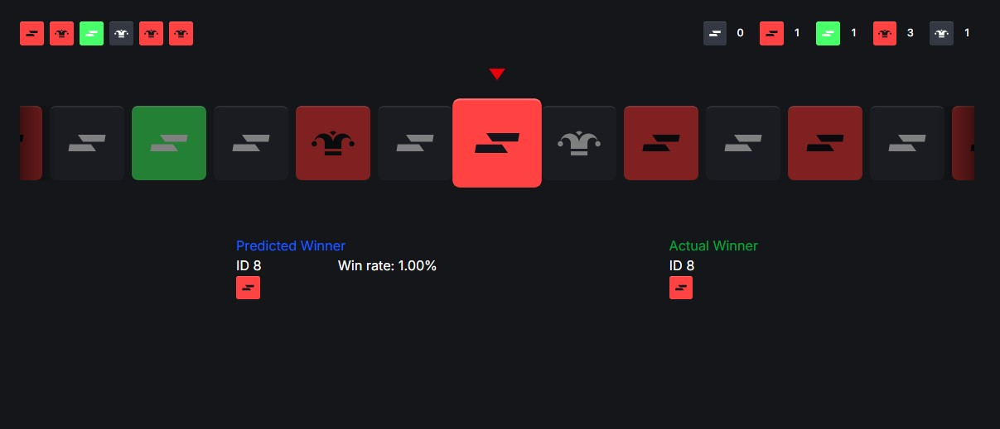

# Roulette

**[LIVE PAGE](https://roulette-five-lilac.vercel.app/)**



# Project Overview

This project implements a **roulette** game with the following features and flow:

---

## Game Flow

1. **Winner Selection**  
   Before each spin starts, a **winning card** is selected in advance based on the predefined
   chances of winning.  
   This predicted winner is displayed **below the roulette** as the **predicted winner**.

2. **Spinning Animation**  
   The roulette wheel then begins to spin:

   - It first **accelerates** to reach maximum speed.
   - Then it spins at **maximum speed** for some time.
   - Finally, it **decelerates** smoothly until it stops.

3. **Centering the Winning Card**  
   When the spinning stops, if the center of the winning card does **not align exactly** with the
   arrow indicator, an animation adjusts the roulette position to place the winning card perfectly
   centered under the arrow.

4. **Winner Display & Countdown**  
   After the card is centered, a **winning card animation** is shown.  
   Then, a **countdown timer** appears, indicating the time until the next spin starts.

---

## UI Layout

- **Top Section**:  
  Displays two panels side-by-side:

  - **Winner History**: Shows the last 10 winning cards.
  - **Win Statistics**: Tracks how many times each card has won.

- **Middle Section**:  
  Contains the **roulette wheel** with cards spinning horizontally, and an arrow at the center
  pointing to the winning card.

- **Bottom Section**:  
  Displays the **predicted winner** card before the spin starts,  
  as well as the **actual winning card** after the spin ends.

---

## Summary

- The roulette simulates a realistic spin with acceleration and deceleration phases.
- The predicted winner is chosen according to the chances and shown before the spin.
- The final winner is always perfectly centered under the arrow.
- History and statistics panels provide feedback on recent outcomes and card performance.

---

This structured flow ensures a smooth user experience and clear visualization of the game state at
every stage.

This is a [Next.js](https://nextjs.org) project bootstrapped with
[`create-next-app`](https://nextjs.org/docs/app/api-reference/cli/create-next-app).

## Getting Started

First, run the development server:

```bash
npm run dev
# or
yarn dev
# or
pnpm dev
# or
bun dev
```

Open [http://localhost:3000](http://localhost:3000) with your browser to see the result.
